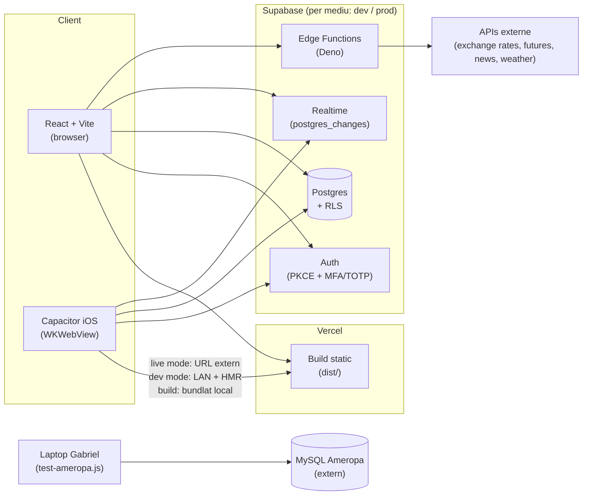

# Arhitectura Farmer App — Plan de scalabilitate, securitate & UX

**Țintă:** 5000+ utilizatori activi în ~12 luni (majoritar fermieri pe mobil/iOS, până la ~20 admini pe desktop).
**Stare la data acestui document:** actualizat 2026-09-05. 9 profile în producție (4 fermieri, 5 admini), tabela `bids` cu 96 de rânduri. Faza 0 e complet închisă. Faza 1 e aproape închisă: RLS reparat (inclusiv ultimele 3 avertismente `multiple_permissive_policies` + cel de `auth_rls_initplan` rămas pe `device_tokens`), `FarmiersTab` paginat, `rate_limits` conectat, secretele MySQL clarificate ca fals pozitiv (nu era nimic de mutat). Rămâne deschis un singur lucru real: upgrade-ul la Supabase Pro (decizie de billing) — de care depinde şi leaked-password toggle-ul, blocat pe planul Free.
**Audiență:** Gabriel (owner/dev solo) + IT lead, pentru revizuire tehnică.

---

## 1. Rezumat executiv

Fundația e mai solidă decât media unui proiect la acest stadiu: MFA obligatoriu pentru admini, RLS pe toate tabelele cu date sensibile, un hook de realtime cu reconnect/backoff/health-check scris ca pentru producție, și un pattern de scalabilitate (paginare + RPC-uri agregate + coloane explicite) demonstrat acum pe `BidsTab` **și** `FarmiersTab`. Nu pornim de la zero, și de la ultima versiune a acestui document am închis o bucată reală din lista de lacune.

Ce s-a rezolvat efectiv de la ultima versiune (2026-09-05):

- **Faza 0, punctul 3 era doar marcat ✅ în document, dar nu era făcut** — codul mort de recompense (`RewardsContext`, cele 3 apeluri `addFarmerRewardsPoints`) încă exista în repo, verificat direct în git log. A fost scos, de-adevăratelea.
- **`FarmiersTab` paginat** — acelaşi pattern ca `BidsTab`: keyset pe `(created_at, id)`, căutare server-side, index dedicat.
- **`rate_limits` conectat efectiv** — RPC `check_rate_limit()` + wiring în toate funcțiile Edge publice (`exchange-rates`, `gnews`, `grain-futures`, `sharp-proxy`, `invite-farmer`).
- **RLS reparat pe advisor-ul de performanță** — `auth.<fn>()` înfășurat în `(select ...)`, politici duplicate unite.
- **Un incident real, cauzat de mine, reparat în aceeași sesiune** — vezi secțiunea 4.5. Merită documentat cinstit, nu ascuns: o migrație de performanță RLS a introdus o recursie infinită pe `profiles`, care a picat login-ul în producție ~40 de minute. Lecția e prinsă mai jos și aplicată deja unde era relevant.
- **Ultimele 3 avertismente `multiple_permissive_policies`, lăsate deschise intenționat pe 2026-09-03** — rezolvate 2026-09-05: `commodities`/`silo_price_configs` aveau politica de admin declarată `FOR ALL`, deci ramura ei de SELECT se evalua dublu alături de politica dedicată de citire (`qual = true`); despărțită în INSERT/UPDATE/DELETE, fără nicio schimbare de comportament (SELECT-ul adminilor trecea deja prin politica de citire). `device_tokens` avea ambele politici declarate pentru `{public}` (toate rolurile), deşi condițiile lor restrângeau deja la `service_role`, respectiv `authenticated` — rescope cu `ALTER POLICY ... TO ...`, fără schimbare de qual. Plus un avertisment separat, ratat pe 2026-09-03 pentru că politica nu există pe dev: `device_tokens.service_read_all_tokens` (doar pe prod) nu avea `auth.role()` înfășurat în `(select ...)`. Ambele migrații (`20260905120000`, `20260905120100`) sunt idempotente față de drift-ul dev/prod (`if exists` pe `service_read_all_tokens`), aplicate întâi pe dev, verificate cu interogări impersonate (`SET ROLE authenticated`/`service_role` + `request.jwt.claims`) înainte și după, apoi aplicate pe prod și reverificate acolo.
- **Drift-ul de versiuni pe migrările din iulie, pe ambele medii** — rezolvat 2026-09-05. `bid_stats_rpc`, `bid_filter_options`, `bid_counts_rpc`, `bids_status_changed_at` rulaseră şi pe dev şi pe prod, dar sub un alt număr de versiune decât numele fişierului local (şi diferit între dev şi prod!). `bids_scalability_indexes` şi `revoke_trigger_function_execute` rulaseră pe ambele — verificat direct (indexurile există, permisiunile chiar sunt revocate), nu doar presupus — dar nu apăreau deloc în evidenţă. Reparat direct pe tabelul intern `supabase_migrations.schema_migrations` (`UPDATE`/`INSERT` doar pe evidenţă, zero schimbare de schemă sau date), întâi pe dev, verificat, apoi pe prod. În căutarea asta am descoperit şi de ce dev nu are flag-ul activ/inactiv la comodităţi şi cele 2 trigger-e de notificare push (contraofertă, schimbare de preţ): funcţiile există pe dev, dar trigger-ele nu au fost niciodată ataşate — probabil intenţionat, ca dev să nu trimită notificări reale prin funcţia de producţie (codul are URL-ul şi cheia de prod hardcodate). Gabriel a confirmat şi a decis să lase aşa. Migrarea `secure_send_push` (doar pe prod, întăreşte triggerele cu un secret intern) rămâne fără fişier local — dinadins, ca să nu fie aplicată accidental pe dev de un viitor `supabase db push`. Rămâne deschis doar istoricul dev dinainte de iulie (martie–aprilie), mai vechi şi mai mare — vezi secţiunea 11.

Ce rămâne deschis, neschimbat față de ultima versiune:

- ~~Secretele MySQL tot în `.env` local, nu în `supabase secrets set`~~ — **fals pozitiv, închis 2026-09-05**: nicio funcție Edge nu citește `AMEROPA_DB_*`, doar scriptul local `test-ameropa.js`. Un secret Supabase e vizibil doar codului care rulează pe infrastructura Supabase — un script local nu are cum să-l citească oricum, deci n-avea unde să fie „mutat". `.env` fiind gitignored e deja protecția corectă pentru acest caz.
- Upgrade Supabase → Pro — decizie de billing, nu de cod.
- `sharp-proxy` — descoperire nouă: e deployat doar pe dev, nu şi pe prod, iar clientul lui (`src/services/sharpApi.js`) nu e folosit nicăieri în `src/`. Pare integrare neterminată. Nu am atins-o fără o decizie explicită.

Verdict neschimbat: arhitectura **poate susține 5000 utilizatori**, are nevoie de restul fixurilor țintite din secțiunea 11, nu de o rescriere.

---

## 2. Context & obiective

| | |
|---|---|
| Orizont de timp | ~12 luni până la 5000+ utilizatori |
| Profil utilizatori | Majoritar fermieri, mobil/iOS via Capacitor; până la ~20 admini/traderi, desktop |
| Buget | Discutat: upgrade la planuri Pro (Supabase, eventual Vercel) |
| Developer | Solo (Gabriel) |
| Motivație | Continuarea dezvoltării aplicației; IT lead a cerut o revizuire a arhitecturii înainte să se meargă mai departe — sustenabilitate, capacitate de creștere, siguranță |
| Grija principală | Scalabilitate, posibile bucle/pattern-uri ineficiente în cod, arhitectură nesustenabilă, fiabilitatea notificărilor realtime, crash-uri |

---

## 3. Arhitectura actuală (as-is)

Notă: nicio funcție Edge nu se conectează la MySQL — verificat 2026-09-05, `AMEROPA_DB_*` e citit doar de `test-ameropa.js`, rulat manual, local. Diagrama veche arăta greşit o legătură `EF --> MySQL`; corectată aici.

**Straturi:**
- **Frontend:** React 19 SPA, o singură rută `/dashboard` care randează `FarmerDashboard` sau `AdminDashboard` după `role`. Fără server-side rendering — tot ce vede utilizatorul e calculat client-side după ce sesiunea Supabase se rezolvă.
- **Auth:** `useAuth.jsx` centralizează user/role/profile/AAL. Admin fără MFA e blocat la `MFASetup`; admin cu MFA dar AAL1 e blocat la `MFAVerify`. Fermierii nu au MFA impus.
- **Date:** Context React pentru `commodities` (prețuri). **Bids nu au context, intenționat** — fiecare ecran cere exact ce afișează (paginat, filtrat server-side), pentru că un context comun încărca toată tabela pentru toți utilizatorii. (Contextul de `rewards` a existat, era mort, și a fost scos efectiv pe 2026-09-03 — vezi 4.1.)
- **Realtime:** un hook generic (`useRealtimeSubscription`) cu reconnect exponențial, resincronizare la `visibilitychange` și la `appStateChange` (Capacitor), plus un health-check la 20s pentru cazul specific iOS unde WKWebView poate omorî silențios conexiunea WebSocket.
- **Edge Functions:** 5 funcții Deno pe prod — 3 proxy-uri de date externe (exchange-rates, grain-futures, gnews), `invite-farmer` (service_role), `send-push`; toate rate-limitate acum (vezi 4.1). `sharp-proxy` există doar pe dev.
- **Mobil:** Capacitor cu două moduri de dezvoltare independente — `cap:dev:on` (HMR live pe LAN) și `cap:live:on` (build TestFlight care încarcă un URL web deployat, fără rebuild nativ la fiecare schimbare).
- **Mediu:** split real dev/prod — proiecte Supabase separate, fișiere env separate, niciodată aceleași date.

---

## 4. Constatări din audit

Legenda: 🔴 critic (acționează acum) · 🟠 sever (înainte de creștere serioasă a traficului) · 🟡 mediu (planificat, nu urgent) · 🔵 info (deja bine făcut, de păstrat)

### 4.1 🔴 Critic — ✅ Rezolvat (2026-08-25 pe prod, 2026-09-03 în repo)

**Funcții Edge de test, fără autentificare, expuse public.**
`supabase/functions/test-mysql/index.ts` și `test-ameropa-db/index.ts` nu verificau deloc *cine* apelează şi aveau `Access-Control-Allow-Origin: "*"`. Şterse din producţie pe 25 august — dar fișierele sursă rămăseseră moarte în repo până pe 3 septembrie, când au fost scoase efectiv (nu apăreau în niciun commit înainte de asta, deşi documentul le marca deja ca rezolvate).
→ **Acțiune realizată:** funcțiile șterse din prod şi din repo; `test-ameropa.js` local acoperă aceeaşi nevoie de testare.

### 4.2 🟠 Sever — ✅ Rezolvat (2026-09-03)

**Scrierea de recompense fermieri era complet ruptă — şi, spre deosebire de ce scria aici înainte, chiar era încă în cod.**
`RewardsContext.jsx` interoga şi scria coloane `points`/`updated_at` pe `farmer_rewards`, care nu există (coloanele reale sunt `reward_type, unlocked_at, used, target_t, bonus_eur, bonus_tonnes, lock_product, lock_days, lock_limit_tonnes`), iar singura policy RLS pe tabelă era `farmer_rewards_select_own` — fără INSERT/UPDATE, deci scrierea eşua oricum din motive de permisiuni. `addFarmerRewardsPoints` era apelat din `ActivityTab.jsx` şi `AdminBidDetailModal.jsx` la fiecare acceptare de ofertă, eşua silenţios, şi nimic nu citea `farmerRewards`.
→ **Acțiune realizată:** eliminate cele 3 apeluri, `RewardsContext.jsx` şi wiring-ul din `AppContext.jsx`. `FarmerProgress.jsx` (progresul pe tone, vizibil fermierilor) neatins — calculează direct din `bids`, nu era afectat niciodată.

**Lista de fermieri nu era paginată.** → **Rezolvat.** `FarmiersTab.jsx` foloseşte acum acelaşi pattern ca `BidsTab`: keyset pagination pe `(created_at, id)` — nu doar `id`, fiindcă două rânduri din prod au exact acelaşi `created_at` (upsert în bulk) — căutare server-side prin `ilike`, index dedicat `idx_profiles_role_created_at`.

**Infrastructură de rate limiting construită, dar moartă.** → **Rezolvat.** `check_rate_limit(key, limit, window_seconds)` — RPC atomic, `SECURITY DEFINER`, grantat doar către `service_role` (niciun caller nu poate falsifica cheia/limita altcuiva) — conectat prin `supabase/functions/_shared/rateLimit.ts` în `exchange-rates` (30/min), `gnews` (20/min), `invite-farmer` (30/oră), `grain-futures` şi `sharp-proxy` (pe IP, n-au auth de user). `bids` are propriul limiter separat (`check_bid_rate_limit`), neatins.

**Leaked password protection dezactivat.** Încă deschis — toggle din dashboard, fără cost de dezvoltare, dar niciun tool automat nu-l poate activa.

**Politici RLS re-evaluau funcţii de autentificare per rând + politici duplicate.** → **Rezolvat.** Vezi 4.5 pentru cum s-a făcut şi ce a picat pe parcurs, şi rezumatul din secţiunea 1 pentru cele 3 avertismente `multiple_permissive_policies` rămase, închise pe 2026-09-05.

### 4.3 🟡 Mediu

- **Foreign keys neindexate:** rezolvat — `farmer_rewards.farmer_id` şi `profiles.invited_by` au acum index.
- **Fără strat de servicii pentru acces la date.** Neschimbat — `supabase.from(...)` direct din componente. Funcţional acum, devine friction la echipă mai mare.
- **Fişiere monolitice:** `Motherboard.jsx` (1490 linii), `BidsTab.jsx` (827 linii), `ActivityTab.jsx` (683 linii). Neschimbat.
- **Fără suită de teste.** Neschimbat. Cel mai mare risc care creşte cu fiecare funcţionalitate nouă pe un flow financiar.
- ~~**`.env` local conţine credenţiale MySQL**~~ — închis 2026-09-05, vezi rezumatul din secţiunea 1: e folosit doar de un script local, nu de vreo funcţie Edge, deci `.env` gitignored e suficient.

### 4.4 🔵 De păstrat (deja bine făcut)

- **MFA obligatoriu pentru admini**, cu fallback sigur la eşec de verificare.
- **Pattern de scalabilitate** — acum pe **două** ecrane (`BidsTab` şi `FarmiersTab`): paginare, coloane explicite, RPC-uri dedicate, indexuri dedicate.
- **Hook de realtime robust**.
- **Security headers** în `vercel.json`.
- **Split real dev/prod**.
- **Sentry integrat**, neschimbat — tot nealertat activ (secţiunea 10).

### 4.5 🔴 Nou — incident live, cauzat şi reparat în această sesiune

**Migrația de performanţă RLS a introdus o recursie infinită pe `profiles`, care a picat login-ul în producţie.**
La reparaţia advisor-ului de performanţă (4.2), politicile duplicate de SELECT pe `profiles` (`admin_read_all_profiles` + `users_can_read_own_profile`) au fost unite într-o singură politică cu OR. Ordinea aleasă a fost `(is_admin(...) AND aal2) OR (id = auth.uid())` — ramura scumpă întâi. `is_admin(uid)` interoghează intern `profiles` pentru rândul *propriu* al utilizatorului; când Postgres evalua acea interogare internă, RLS-ul lui `profiles` se reevalua, iar cu ramura scumpă verificată prima, niciodată nu ajungea la ramura ieftină şi terminală (`id = auth.uid()`) înainte să apeleze din nou `is_admin()` — recursie infinită, „stack depth limit exceeded", 500 pe orice citire de profil. Login-ul propriu-zis (Supabase Auth) mergea perfect — de-aia logurile de auth arătau curat — dar `useAuth.jsx` nu putea niciodată încărca rolul, aşa că aplicaţia rămânea blocată chiar după un login reuşit.

Diagnosticat prin reproducerea exactă a request-ului eşuat (`SET ROLE authenticated` + `request.jwt.claims`), care a arătat direct stiva recursivă. Reparat prin inversarea ordinii — verificarea ieftină întâi — verificat imediat pe ambele ramuri (citire proprie + admin citind alt profil / bids). Aceeaşi ordine „scump întâi" exista şi pe `bids_select_policy`/`bids_update_policy` (fără risc de recursie acolo, dar acelaşi obicei greşit) — corectată din precauţie.

→ **Lecţie prinsă în `CLAUDE.md`:** când se unesc într-o singură politică OR o ramură `is_admin(...)` cu o verificare de proprietar auto-referenţială, verificarea de proprietar **trebuie** să fie prima — `is_admin()` depinde mereu de acelaşi short-circuit ca să se termine.

---

## 5. Arhitectura țintă pentru 5000+ utilizatori / 12 luni

Ideea centrală rămâne: **generalizează ce funcţionează deja**, plus completările de infrastructură rămase.

### 5.1 Bază de date

**Planul Supabase — decis 2026-09-05, cifre verificate la zi (nu presupuse):**

Cele 2 proiecte (dev + prod) sunt pe Free acum. Planul Pro se plăteşte **per proiect**, nu per organizaţie.

| Pas | Ce facem | Cost | Când |
|---|---|---|---|
| 1 | Upgrade **doar prod** la Pro | ~25 $/lună | Următorul pas decis, neexecutat încă — decizie de billing a lui Gabriel |
| 2 | Dev rămâne pe Free | 0 $ | Pauzarea după 7 zile de inactivitate e o bătaie de cap acceptată, nu un risc de business |
| 3 | SMTP propriu pentru `invite-farmer` | gratis, independent de Pro | Înainte de orice val mare de invitaţii — Pro **nu** ridică limita de 2 email-uri/oră a serviciului default; doar un SMTP propriu o face (implicit 30/oră, ajustabil) |
| 4 | PITR (point-in-time recovery) | ~140 $/lună (25 Pro + 15 compute Small + 100 PITR/7 zile) | **Nu acum** — backup-urile zilnice incluse în Pro sunt suficiente la volumul curent (96 rânduri `bids`). Revizitează când volumul zilnic de oferte ajunge la un punct unde "am pierdut ultimele ore" ar costa efectiv bani, nu doar teoretic |
| 5 | Compute add-on peste Micro-ul inclus | de la 15 $/lună (Small) în sus | Doar dacă, după upgrade la Pro, tot apar timeout-uri de conexiune sub trafic real — nu preventiv |
| 6 | Realtime peste 500 conexiuni incluse | 10 $/1000 conexiuni suplimentare | Cost aşteptat, nu evitabil, pe măsură ce fermierii activi simultan cresc spre 5000 |

De ce prod, nu ambele, şi de ce nu tot pachetul deodată: la 9 utilizatori şi 96 rânduri în `bids`, riscul real de azi e lipsa completă a oricărui backup pe prod (rezolvată de pasul 1 singur) şi limita de 200 conexiuni Realtime concurente care s-ar lovi mult înainte de 5000 utilizatori (rezolvată tot de pasul 1, la 500 incluse). PITR şi compute suplimentar sunt costuri reale (140$+/lună) care nu-şi arată încă valoarea la acest volum — le adăugăm când datele arată nevoia, nu preventiv "ca să fie".

- **Pattern-ul `bids`/`FarmiersTab`** generalizat — orice listă nouă care poate creşte urmează acelaşi model.
- **RLS reparat** — cu grijă la ordinea OR-urilor de-acum încolo (vezi 4.5).
- **Migration hygiene**: parţial rezolvat 2026-09-05 — vezi rezumatul din secţiunea 1. Rămâne deschis istoricul dev dinainte de iulie (mai vechi şi mai mare, vezi mai jos).

### 5.2–5.4
Neschimbate faţă de versiunea anterioară a documentului — strat de servicii, caching/code-splitting, şi rate limiting sunt discutate acolo unde rate limiting-ul e acum **făcut** (5.4), restul rămân planificate.

---

## 6. Securitate

| Domeniu | Stare actuală | Acțiune recomandată |
|---|---|---|
| RLS | Activ, reparat pe advisor-ul de perf; **un bug de recursie introdus şi reparat în aceeaşi sesiune** (4.5) | La orice OR nou cu `is_admin(...)`: verificarea de proprietar întâi |
| MFA | Obligatoriu pt admini, opţional pt fermieri | Păstrează |
| Rate limiting | **Conectat efectiv** (2026-09-03) | Monitorizează dacă limitele alese (30/min, 20/min, 30/oră etc.) sunt potrivite la trafic real |
| Parole compromise | Dezactivat, **blocat pe planul Free** (2026-09-05) | Necesită upgrade Pro întâi — toggle-ul e needitabil fără el |
| Funcţii Edge de test | Şterse din prod şi din repo | — |
| Secrete MySQL | În `.env` local, folosit doar de scriptul local `test-ameropa.js` | Rezolvat — nicio funcţie Edge nu are nevoie de el ca secret Supabase; `.env` gitignored e suficient |
| Backup | Niciunul, plan Free | Upgrade Pro pe prod → backup zilnic inclus (vezi planul din 5.1) |
| Security headers | Prezente | Păstrează |

---

## 7–10. Realtime, flow-uri, UI/UX, monitorizare

Neschimbate faţă de versiunea anterioară a documentului.

---

## 11. Roadmap pe faze (actualizat 2026-09-03)

**Faza 0 — ✅ Complet închisă:**
1. ✅ Funcţii de test şterse din prod (2026-08-25) **şi din repo** (2026-09-03 — nu era făcut cum scria aici).
2. ⬜ Leaked password protection — tot manual, tot deschis.
3. ✅ Recompense: cod mort scos efectiv (2026-09-03, nu doar marcat).

**Faza 1 — Lunile 1–2:**
4. ✅ Paginare server-side pe `FarmiersTab` (2026-09-03).
5. ✅ RLS: `(select auth.<fn>())` + politici duplicate unite + FK-uri indexate (2026-09-03) — **plus fix de recursie şi reordonare, vezi 4.5**, **plus ultimele 3 avertismente `multiple_permissive_policies` şi cel de `auth_rls_initplan` pe `device_tokens`, închise 2026-09-05**. Advisor-ul de securitate/performanţă e curat pe dev şi prod acum, în afară de indexurile INFO nefolosite şi toggle-ul de mai jos.
6. ✅ `rate_limits` conectat pe funcţiile Edge publice (2026-09-03). Login e acoperit de rate limiting-ul nativ Supabase Auth (de verificat în dashboard, neschimbat).
7. ⬜ Leaked password protection — **descoperire 2026-09-05: toggle-ul e blocat pe planul Free** ("Only available on Pro plan and above" direct în UI-ul Supabase, verificat de Gabriel în dashboard pe proiectul de producţie). Nu e o simplă bifă manuală cum credeam — depinde de punctul 9 (upgrade Pro).
8. ✅ ~~Mută credenţialele MySQL din `.env` în `supabase secrets set`~~ — închis 2026-09-05 ca fals pozitiv: nicio funcţie Edge nu foloseşte `AMEROPA_DB_*`, doar `test-ameropa.js` local. Nimic de mutat.
9. ⬜ Upgrade Supabase la Pro — **plan concret stabilit 2026-09-05, vezi secţiunea 5.1**: doar prod, ~25$/lună, PITR şi compute suplimentar amânate până le justifică volumul real. Rămâne doar apăsarea butonului de billing — decizia lui Gabriel.

**Faza 2 — Lunile 3–6:** neschimbată.

**Faza 3 — Lunile 6–12:** neschimbată.

---

## 12. Riscuri deschise / decizii pentru IT lead

Neschimbate, plus:

- **`sharp-proxy`** — există doar pe dev, nu şi pe prod; clientul lui nu e folosit nicăieri. Gabriel a decis 2026-09-05 să-l lase aşa deocamdată — nicio acţiune, revizitat doar dacă apare un plan concret de folosire.
- **Disciplina de ordonare în politici RLS** — incidentul din 4.5 arată că merge-ul de politici OR e uşor de greşit şi costul unei greşeli e o cădere totală de producţie. Orice modificare viitoare de RLS ar trebui testată cu o interogare directă (impersonare via `SET ROLE` + `request.jwt.claims`) înainte de a fi considerată gata, nu doar citită vizual.
- **Istoricul de migrări pe dev, dinainte de iulie** — rămas deschis după curăţenia din 2026-09-05 (care a acoperit doar drift-ul confirmat din iulie încoace). Dev foloseşte numere de versiune complet diferite de prod şi de fişierele locale pentru tot ce ţine de martie–aprilie, plus 2 migrări (`add_bid_rate_limit_trigger`, `fix_bid_rate_limit_search_path`) fără niciun fişier local corespondent. Schema pare corectă (verificată punctual, nu exhaustiv) — problema e doar în evidenţă — dar merită o trecere dedicată înainte de a rula vreodată `supabase db push` pe dev.
- **`secure_send_push`** — migrare reală, doar pe prod, lăsată dinadins fără fişier local (vezi rezumatul din secţiunea 1), ca să nu ajungă aplicată pe dev de un tool care nu ştie de excepţie. Dacă cineva rescrie vreodată tooling-ul de deploy sau trece la alt flux de migrări, această excepţie trebuie reamintită explicit.
