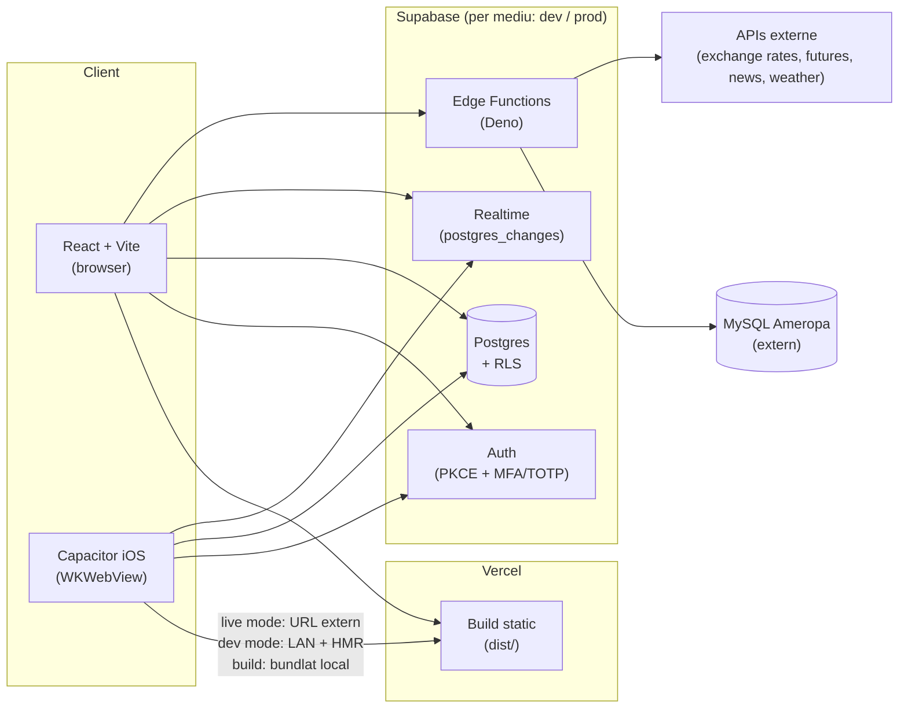

# Arhitectura Farmer App — Plan de scalabilitate, securitate & UX

**Țintă:** 5000+ utilizatori activi în ~12 luni (majoritar fermieri pe mobil/iOS, până la ~20 admini pe desktop).
**Stare la data acestui document:** actualizat 2026-09-03. 9 profile în producție (4 fermieri, 5 admini), tabela `bids` cu 96 de rânduri. Faza 0 e complet închisă (inclusiv partea care fusese doar marcată, nu și făcută). Faza 1 e parțial închisă: RLS reparat, `FarmiersTab` paginat, `rate_limits` conectat. Rămân deschise: secretele MySQL, upgrade-ul la Supabase Pro.
**Audiență:** Gabriel (owner/dev solo) + IT lead, pentru revizuire tehnică.

---

## 1. Rezumat executiv

Fundația e mai solidă decât media unui proiect la acest stadiu: MFA obligatoriu pentru admini, RLS pe toate tabelele cu date sensibile, un hook de realtime cu reconnect/backoff/health-check scris ca pentru producție, și un pattern de scalabilitate (paginare + RPC-uri agregate + coloane explicite) demonstrat acum pe `BidsTab` **și** `FarmiersTab`. Nu pornim de la zero, și de la ultima versiune a acestui document am închis o bucată reală din lista de lacune.

Ce s-a rezolvat efectiv de la ultima versiune (2026-09-03):

- **Faza 0, punctul 3 era doar marcat ✅ în document, dar nu era făcut** — codul mort de recompense (`RewardsContext`, cele 3 apeluri `addFarmerRewardsPoints`) încă exista în repo, verificat direct în git log. A fost scos azi, de-adevăratelea.
- **`FarmiersTab` paginat** — acelaşi pattern ca `BidsTab`: keyset pe `(created_at, id)`, căutare server-side, index dedicat.
- **`rate_limits` conectat efectiv** — RPC `check_rate_limit()` + wiring în toate funcțiile Edge publice (`exchange-rates`, `gnews`, `grain-futures`, `sharp-proxy`, `invite-farmer`).
- **RLS reparat pe advisor-ul de performanță** — `auth.<fn>()` înfășurat în `(select ...)`, politici duplicate unite.
- **Un incident real, cauzat de mine, reparat în aceeași sesiune** — vezi secțiunea 4.5. Merită documentat cinstit, nu ascuns: o migrație de performanță RLS a introdus o recursie infinită pe `profiles`, care a picat login-ul în producție ~40 de minute. Lecția e prinsă mai jos și aplicată deja unde era relevant.

Ce rămâne deschis, neschimbat față de ultima versiune:

- Secretele MySQL tot în `.env` local, nu în `supabase secrets set` — nu am putut verifica/muta pentru că fișierul `.env` nu există în checkout-ul cu care am lucrat (gitignored, local-only la tine).
- Upgrade Supabase → Pro — decizie de billing, nu de cod.
- `sharp-proxy` — descoperire nouă: e deployat doar pe dev, nu şi pe prod, iar clientul lui (`src/services/sharpApi.js`) nu e folosit nicăieri în `src/`. Pare integrare neterminată. Nu am atins-o fără o decizie explicită.

Verdict neschimbat: arhitectura **poate susține 5000 utilizatori**, are nevoie de restul fixurilor țintite din secțiunea 11, nu de o rescriere.

---

## 2. Context & obiective

| | |
|---|---|
| Orizont de timp | ~12 luni până la 5000+ utilizatori |
| Profil utilizatori | Majoritar fermieri, mobil/iOS via Capacitor; până la ~20 admini/traderi, desktop |
| Buget | Discutat: upgrade la planuri Pro (Supabase, eventual Vercel) |
| Developer | Solo (Gabriel) |
| Motivație | Continuarea dezvoltării aplicației; IT lead a cerut o revizuire a arhitecturii înainte să se meargă mai departe — sustenabilitate, capacitate de creștere, siguranță |
| Grija principală | Scalabilitate, posibile bucle/pattern-uri ineficiente în cod, arhitectură nesustenabilă, fiabilitatea notificărilor realtime, crash-uri |

---

## 3. Arhitectura actuală (as-is)

**Straturi:**
- **Frontend:** React 19 SPA, o singură rută `/dashboard` care randează `FarmerDashboard` sau `AdminDashboard` după `role`. Fără server-side rendering — tot ce vede utilizatorul e calculat client-side după ce sesiunea Supabase se rezolvă.
- **Auth:** `useAuth.jsx` centralizează user/role/profile/AAL. Admin fără MFA e blocat la `MFASetup`; admin cu MFA dar AAL1 e blocat la `MFAVerify`. Fermierii nu au MFA impus.
- **Date:** Context React pentru `commodities` (prețuri). **Bids nu au context, intenționat** — fiecare ecran cere exact ce afișează (paginat, filtrat server-side), pentru că un context comun încărca toată tabela pentru toți utilizatorii. (Contextul de `rewards` a existat, era mort, și a fost scos efectiv pe 2026-09-03 — vezi 4.1.)
- **Realtime:** un hook generic (`useRealtimeSubscription`) cu reconnect exponențial, resincronizare la `visibilitychange` și la `appStateChange` (Capacitor), plus un health-check la 20s pentru cazul specific iOS unde WKWebView poate omorî silențios conexiunea WebSocket.
- **Edge Functions:** 5 funcții Deno pe prod — 3 proxy-uri de date externe (exchange-rates, grain-futures, gnews), `invite-farmer` (service_role), `send-push`; toate rate-limitate acum (vezi 4.1). `sharp-proxy` există doar pe dev.
- **Mobil:** Capacitor cu două moduri de dezvoltare independente — `cap:dev:on` (HMR live pe LAN) și `cap:live:on` (build TestFlight care încarcă un URL web deployat, fără rebuild nativ la fiecare schimbare).
- **Mediu:** split real dev/prod — proiecte Supabase separate, fișiere env separate, niciodată aceleași date.

---

## 4. Constatări din audit

Legenda: 🔴 critic (acționează acum) · 🟠 sever (înainte de creștere serioasă a traficului) · 🟡 mediu (planificat, nu urgent) · 🔵 info (deja bine făcut, de păstrat)

### 4.1 🔴 Critic — ✅ Rezolvat (2026-08-25 pe prod, 2026-09-03 în repo)

**Funcții Edge de test, fără autentificare, expuse public.**
`supabase/functions/test-mysql/index.ts` și `test-ameropa-db/index.ts` nu verificau deloc *cine* apelează şi aveau `Access-Control-Allow-Origin: "*"`. Şterse din producţie pe 25 august — dar fișierele sursă rămăseseră moarte în repo până pe 3 septembrie, când au fost scoase efectiv (nu apăreau în niciun commit înainte de asta, deşi documentul le marca deja ca rezolvate).
→ **Acțiune realizată:** funcțiile șterse din prod şi din repo; `test-ameropa.js` local acoperă aceeaşi nevoie de testare.

### 4.2 🟠 Sever — ✅ Rezolvat (2026-09-03)

**Scrierea de recompense fermieri era complet ruptă — şi, spre deosebire de ce scria aici înainte, chiar era încă în cod.**
`RewardsContext.jsx` interoga şi scria coloane `points`/`updated_at` pe `farmer_rewards`, care nu există (coloanele reale sunt `reward_type, unlocked_at, used, target_t, bonus_eur, bonus_tonnes, lock_product, lock_days, lock_limit_tonnes`), iar singura policy RLS pe tabelă era `farmer_rewards_select_own` — fără INSERT/UPDATE, deci scrierea eşua oricum din motive de permisiuni. `addFarmerRewardsPoints` era apelat din `ActivityTab.jsx` şi `AdminBidDetailModal.jsx` la fiecare acceptare de ofertă, eşua silenţios, şi nimic nu citea `farmerRewards`.
→ **Acțiune realizată:** eliminate cele 3 apeluri, `RewardsContext.jsx` şi wiring-ul din `AppContext.jsx`. `FarmerProgress.jsx` (progresul pe tone, vizibil fermierilor) neatins — calculează direct din `bids`, nu era afectat niciodată.

**Lista de fermieri nu era paginată.** → **Rezolvat.** `FarmiersTab.jsx` foloseşte acum acelaşi pattern ca `BidsTab`: keyset pagination pe `(created_at, id)` — nu doar `id`, fiindcă două rânduri din prod au exact acelaşi `created_at` (upsert în bulk) — căutare server-side prin `ilike`, index dedicat `idx_profiles_role_created_at`.

**Infrastructură de rate limiting construită, dar moartă.** → **Rezolvat.** `check_rate_limit(key, limit, window_seconds)` — RPC atomic, `SECURITY DEFINER`, grantat doar către `service_role` (niciun caller nu poate falsifica cheia/limita altcuiva) — conectat prin `supabase/functions/_shared/rateLimit.ts` în `exchange-rates` (30/min), `gnews` (20/min), `invite-farmer` (30/oră), `grain-futures` şi `sharp-proxy` (pe IP, n-au auth de user). `bids` are propriul limiter separat (`check_bid_rate_limit`), neatins.

**Leaked password protection dezactivat.** Încă deschis — toggle din dashboard, fără cost de dezvoltare, dar niciun tool automat nu-l poate activa.

**Politici RLS re-evaluau funcţii de autentificare per rând + politici duplicate.** → **Rezolvat parţial.** Vezi 4.5 pentru cum s-a făcut şi ce a picat pe parcurs.

### 4.3 🟡 Mediu

- **Foreign keys neindexate:** rezolvat — `farmer_rewards.farmer_id` şi `profiles.invited_by` au acum index.
- **Fără strat de servicii pentru acces la date.** Neschimbat — `supabase.from(...)` direct din componente. Funcţional acum, devine friction la echipă mai mare.
- **Fişiere monolitice:** `Motherboard.jsx` (1490 linii), `BidsTab.jsx` (827 linii), `ActivityTab.jsx` (683 linii). Neschimbat.
- **Fără suită de teste.** Neschimbat. Cel mai mare risc care creşte cu fiecare funcţionalitate nouă pe un flow financiar.
- **`.env` local conţine credenţiale MySQL** — neschimbat, nu am putut verifica sau muta (fişierul nu există în checkout-ul de lucru).

### 4.4 🔵 De păstrat (deja bine făcut)

- **MFA obligatoriu pentru admini**, cu fallback sigur la eşec de verificare.
- **Pattern de scalabilitate** — acum pe **două** ecrane (`BidsTab` şi `FarmiersTab`): paginare, coloane explicite, RPC-uri dedicate, indexuri dedicate.
- **Hook de realtime robust**.
- **Security headers** în `vercel.json`.
- **Split real dev/prod**.
- **Sentry integrat**, neschimbat — tot nealertat activ (secţiunea 10).

### 4.5 🔴 Nou — incident live, cauzat şi reparat în această sesiune

**Migrația de performanţă RLS a introdus o recursie infinită pe `profiles`, care a picat login-ul în producţie.**
La reparaţia advisor-ului de performanţă (4.2), politicile duplicate de SELECT pe `profiles` (`admin_read_all_profiles` + `users_can_read_own_profile`) au fost unite într-o singură politică cu OR. Ordinea aleasă a fost `(is_admin(...) AND aal2) OR (id = auth.uid())` — ramura scumpă întâi. `is_admin(uid)` interoghează intern `profiles` pentru rândul *propriu* al utilizatorului; când Postgres evalua acea interogare internă, RLS-ul lui `profiles` se reevalua, iar cu ramura scumpă verificată prima, niciodată nu ajungea la ramura ieftină şi terminală (`id = auth.uid()`) înainte să apeleze din nou `is_admin()` — recursie infinită, „stack depth limit exceeded", 500 pe orice citire de profil. Login-ul propriu-zis (Supabase Auth) mergea perfect — de-aia logurile de auth arătau curat — dar `useAuth.jsx` nu putea niciodată încărca rolul, aşa că aplicaţia rămânea blocată chiar după un login reuşit.

Diagnosticat prin reproducerea exactă a request-ului eşuat (`SET ROLE authenticated` + `request.jwt.claims`), care a arătat direct stiva recursivă. Reparat prin inversarea ordinii — verificarea ieftină întâi — verificat imediat pe ambele ramuri (citire proprie + admin citind alt profil / bids). Aceeaşi ordine „scump întâi" exista şi pe `bids_select_policy`/`bids_update_policy` (fără risc de recursie acolo, dar acelaşi obicei greşit) — corectată din precauţie.

→ **Lecţie prinsă în `CLAUDE.md`:** când se unesc într-o singură politică OR o ramură `is_admin(...)` cu o verificare de proprietar auto-referenţială, verificarea de proprietar **trebuie** să fie prima — `is_admin()` depinde mereu de acelaşi short-circuit ca să se termine.

---

## 5. Arhitectura țintă pentru 5000+ utilizatori / 12 luni

Ideea centrală rămâne: **generalizează ce funcţionează deja**, plus completările de infrastructură rămase.

### 5.1 Bază de date
- **Upgrade Supabase la planul Pro** — încă nefăcut. Nota din sesiunea de azi: proiectul e pe Free chiar acum, iar volumul de operaţii MCP (migraţii, deploy-uri, advisors) rulat concentrat a saturat pool-ul de conexiuni suficient cât să producă timeout-uri tranzitorii pe `/token`/`/logout` — un semnal concret, nu doar teoretic, că pool-ul de conexiuni limitat al planului Free e deja o constrângere reală.
- **Pattern-ul `bids`/`FarmiersTab`** generalizat — orice listă nouă care poate creşte urmează acelaşi model.
- **RLS reparat** — cu grijă la ordinea OR-urilor de-acum încolo (vezi 4.5).
- **Migration hygiene**: neschimbat, tot deschis.

### 5.2–5.4
Neschimbate faţă de versiunea anterioară a documentului — strat de servicii, caching/code-splitting, şi rate limiting sunt discutate acolo unde rate limiting-ul e acum **făcut** (5.4), restul rămân planificate.

---

## 6. Securitate

| Domeniu | Stare actuală | Acțiune recomandată |
|---|---|---|
| RLS | Activ, reparat pe advisor-ul de perf; **un bug de recursie introdus şi reparat în aceeaşi sesiune** (4.5) | La orice OR nou cu `is_admin(...)`: verificarea de proprietar întâi |
| MFA | Obligatoriu pt admini, opţional pt fermieri | Păstrează |
| Rate limiting | **Conectat efectiv** (2026-09-03) | Monitorizează dacă limitele alese (30/min, 20/min, 30/oră etc.) sunt potrivite la trafic real |
| Parole compromise | Dezactivat | Activează din Dashboard → Auth |
| Funcţii Edge de test | Şterse din prod şi din repo | — |
| Secrete MySQL | În `.env` local | Mută în `supabase secrets set` — blocat, are nevoie de acces la valorile reale |
| Backup | Manual, plan Free | Upgrade Pro |
| Security headers | Prezente | Păstrează |

---

## 7–10. Realtime, flow-uri, UI/UX, monitorizare

Neschimbate faţă de versiunea anterioară a documentului.

---

## 11. Roadmap pe faze (actualizat 2026-09-03)

**Faza 0 — ✅ Complet închisă:**
1. ✅ Funcţii de test şterse din prod (2026-08-25) **şi din repo** (2026-09-03 — nu era făcut cum scria aici).
2. ⬜ Leaked password protection — tot manual, tot deschis.
3. ✅ Recompense: cod mort scos efectiv (2026-09-03, nu doar marcat).

**Faza 1 — Lunile 1–2:**
4. ✅ Paginare server-side pe `FarmiersTab` (2026-09-03).
5. ✅ RLS: `(select auth.<fn>())` + politici duplicate unite + FK-uri indexate (2026-09-03) — **plus fix de recursie şi reordonare, vezi 4.5**.
6. ✅ `rate_limits` conectat pe funcţiile Edge publice (2026-09-03). Login e acoperit de rate limiting-ul nativ Supabase Auth (de verificat în dashboard, neschimbat).
7. ⬜ Mută credenţialele MySQL din `.env` în `supabase secrets set` — **blocat**, are nevoie de tine (valorile nu sunt accesibile din acest mediu de lucru).
8. ⬜ Upgrade Supabase la Pro — decizie de billing, motivată acum şi de timeout-urile tranzitorii observate azi.

**Faza 2 — Lunile 3–6:** neschimbată.

**Faza 3 — Lunile 6–12:** neschimbată.

---

## 12. Riscuri deschise / decizii pentru IT lead

Neschimbate, plus:

- **`sharp-proxy`** — descoperit azi că există doar pe dev, nu şi pe prod; clientul lui nu e folosit nicăieri. Decizie: se termină integrarea sau se scoate codul mort?
- **Disciplina de ordonare în politici RLS** — incidentul din 4.5 arată că merge-ul de politici OR e uşor de greşit şi costul unei greşeli e o cădere totală de producţie. Orice modificare viitoare de RLS ar trebui testată cu o interogare directă (impersonare via `SET ROLE` + `request.jwt.claims`) înainte de a fi considerată gata, nu doar citită vizual.
